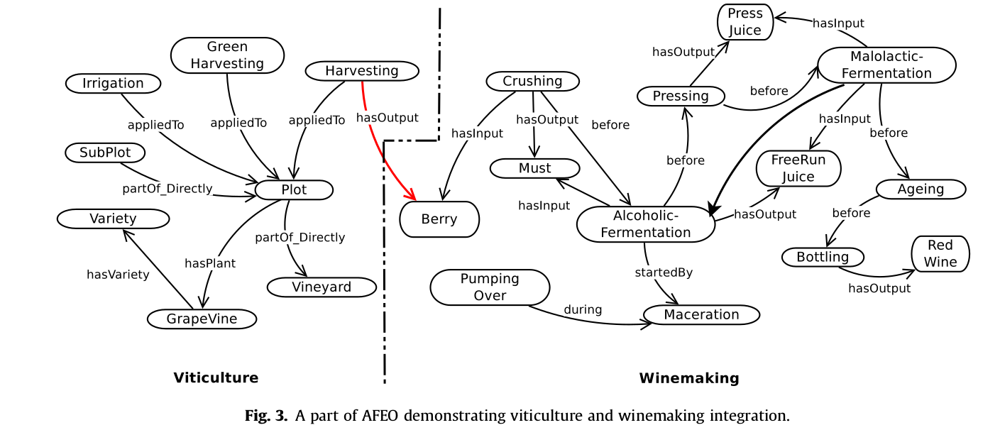

# Source data 

Data samples following info in [INRA, example Competence Questions](https://docs.google.com/document/d/1BEZgyyXT43X8PwxBI2u7p3mjYmtktQ2DWy2lBCVTpBk/edit#heading=h.s88t2el8xvqn)

## Climatic data

[Climatic data](https://drive.google.com/a/ontotext.com/file/d/10iZne1cnySDZJQ_Vpc0h82q8iVKkifqG/view?usp=drivesdk)

| NUM_POSTE | AN   | MOIS | JOUR | AMP | GVX | DH  | DI | DIC | BAC | EP | ETP | ETPP | ETPPC | FRAC | HOX | HON | HOM | RR  | UX | UN | UM | I1N | I1X  | I5N | I5X  | ITX  | ITN  | IUX  | IUN  | IVX  | IRRX | RRX | RG  | RGC | PAR   | TX   | S1X  | TN  | S1N  | TM   | TMC  | S5M  | TD  | U4  | U8   | U9  | TVM  | VET | VNT | VNET | VNWT | VWT | VST | VSET | VSWT | VX   | V   |
|-----------|------|------|------|-----|-----|-----|----|-----|-----|----|-----|------|-------|------|-----|-----|-----|-----|----|----|----|-----|------|-----|------|------|------|------|------|------|------|-----|-----|-----|-------|------|------|-----|------|------|------|------|-----|-----|------|-----|------|-----|-----|------|------|-----|-----|------|------|------|-----|
| 11170004  | 2012 | 1    | 1    | 7.8 | 290 | 4.7 |    | 6.6 |     |    |     | 0.6  |       | 73.0 |     |     |     | 0.0 | 94 | 63 | 79 | 5.5 | 22.4 | 6.9 | 21.6 | 13.3 | 17.9 | 22.1 | 13.4 | 2.9  | 0.0  | 0.0 | 760 | 760 | 363.0 | 17.4 | 11.8 | 9.6 | 10.0 | 12.7 | 13.5 | 10.2 | 9.0 | 0.0 | 10.1 | 4.4 | 11.5 | 0   | 16  | 5    | 54   | 96  | 1   | 0    | 31   | 12.0 | 2.4 |
| 11170004  | 2012 | 1    | 2    | 4.3 | 280 | 6.3 |    | 0.7 |     |    |     | 1.0  |       | 8.0  |     |     |     | 2.5 | 91 | 59 | 79 | 4.3 | 13.9 | 5.3 | 13.7 | 14.0 | 20.9 | 3.1  | 15.2 | 13.8 | 22.4 | 5.0 | 277 | 277 | 143.0 | 12.1 | 10.7 | 7.8 | 10.2 | 10.2 | 10.0 | 10.6 | 6.5 | 0.0 | 13.2 | 1.8 | 9.8  | 0   | 44  | 10   | 120  | 139 | 1   | 0    | 19   | 15.0 | 3.8 |

## Soil characteristics

[Plot cluster.csv](https://drive.google.com/a/ontotext.com/file/d/1Tr4XQsyYULwCJ7H8ISC_v6elLS_qcdtZ/view?usp=drivesdk)

| code | type    | parent    | date_debut | date_fin | geometry                                                                                                                                                                                                                                                                                           | groupeAccess | description | region   | type_sol               | surface | profondeur_sol | cadastre | type_sol               | nom         |
|------|---------|-----------|------------|----------|----------------------------------------------------------------------------------------------------------------------------------------------------------------------------------------------------------------------------------------------------------------------------------------------------|--------------|-------------|----------|------------------------|---------|----------------|----------|------------------------|-------------|
| 73   | terrain | PechRouge | 29/10/56   |          | 01030000206A0800000100000008000000D6389B7657AA2541697407B201C15741E10CFE160BAB2541BFF38B9A0BC157416B47711E37AB2541E00ED4D709C157416475AB5709AB2541F6B69973F8C05741FBC91867EBAA2541F1F44A8DF9C057416189070487AA2541BC77D464FEC0574126A8E1B355AA2541030AF50801C15741D6389B7657AA2541697407B201C15741 |              |             | La Clape | sablo-limono-argileuse | 0,475   |                | A1093    | sablo-limono-argileuse | Cons Israël |

## Plot management

[Field data ObjetCodes and measures.csv](https://drive.google.com/a/ontotext.com/file/d/1jRqSYjzcsY6dCxA9xFNNFK4c7cWfZHLe/view?usp=drivesdk)

| code | type     | parent | surface    | cepage  | clone_cepage | portegreffe | clone_portegreffe | date_debut          | date_fin | densite_plantation | orientation | entre_rangs | entre_ceps | mode_conduite | systeme_taille | nb_rangs | nb_souches | piquets | geometry                                                                                                                                                                                           | description | surgreffage | rang | position_rang | groupeAccess | nom | region   | type_sol | cadastre | profondeur_sol | adresse | label | systeme_irrigation | date_install_si |   |   |
|------|----------|--------|------------|---------|--------------|-------------|-------------------|---------------------|----------|--------------------|-------------|-------------|------------|---------------|----------------|----------|------------|---------|----------------------------------------------------------------------------------------------------------------------------------------------------------------------------------------------------|-------------|-------------|------|---------------|--------------|-----|----------|----------|----------|----------------|---------|-------|--------------------|-----------------|---|---|
|      | parcelle | 73     | 0.48050001 | Macabeu | collection   | 110R        | \N                | 2007-04-01 00:00:00 | \N       | \N                 | 135         | 2.5         | 1          | espalier      | cordon         | 30       | 1893       | fer     | 01030000206A0800000100000005000000F730497734AB2541D0461F260AC157415D2C3E2804AB25411EC64E5CF8C05741F1D0651340AA2541C7972CDB00C15741B4E5526E0BAB2541F28458E00BC15741F730497734AB2541D0461F260AC15741 | \N          | \N          | \N   | \N            | public       | \N  | La Clape | \N       | \N       | \N             | \N      | \N    | t                  | \N              |   |   |

[2017_Harvest Forms.xls](https://drive.google.com/a/ontotext.com/file/d/13WFfny-Lc7nkgm6nHOdJJxYwDMbJHPbq/view?usp=drivesdk)


| code_lot    	| date       	| heure 	| objet       	| poids 	| mode_recolte 	| vers_grappe 	| pourriture 	| commentaire 	| materiels 	| operateurs    	| Nb cep 	| Nb rang 	| Destination                	|
|-------------	|------------	|-------	|-------------	|-------	|--------------	|-------------	|------------	|-------------	|-----------	|---------------	|--------	|---------	|----------------------------	|
| FV-2017-042 	| 08/30/2017 	| 09:45 	| 73-MACCABEU 	| 1110  	| Mécanique    	|             	|            	|             	|           	| fabien.robert 	|        	|         	| STOCK3                     	|
| FV-2017-043 	| 08/30/2017 	| 13:35 	| 73-MACCABEU 	| 1220  	| Mécanique    	|             	|            	|             	|           	| fabien.robert 	|        	|         	| 2017_INERTIS+LALL86+STOCK3 	|


## Winemaking activities 
[White wine 20162017 Information.xlsx](https://drive.google.com/a/ontotext.com/file/d/1Y92XgPXM3PMj959-wtPaAdQJJQyFdD0H/view?usp=drivesdk)

| Code_Ref_PR 	| Responsable 	| Code_essai          	| Date_de_reception_vendange 	| Numeros_parcelle 	| Cepage   	| Poids_(Kg) 	| Operateur 	| Commentaire          	| Numeros_de_Fiche 	| Harvest form 	|
|-------------	|-------------	|---------------------	|----------------------------	|------------------	|----------	|------------	|-----------	|----------------------	|------------------	|--------------	|
| PR028-2017B 	|             	| 2017-INERTYS-MAC-01 	| 30/08/2017                 	| 73               	| Maccabeu 	| 1110       	|           	| Egoutage T0 (20%)    	| 32               	| 42           	|
| PR029-2017B 	|             	| 2017-INERTYS-MAC-01 	| 30/08/2017                 	| 73               	| Maccabeu 	| 1110       	|           	| Presse T4 (20%)      	| 33               	| 42           	|
| PR030-2017B 	|             	| 2017-INERTYS-MAC-01 	| 30/08/2017                 	| 73               	| Maccabeu 	| 1110       	|           	| Presse T5A (20%)     	| 34               	| 42           	|
| PR031-2017B 	|             	| 2017-INERTYS-MAC-01 	| 30/08/2017                 	| 73               	| Maccabeu 	| 1110       	|           	| Presse T5+T6 (20%)   	| 35               	| 42           	|
| PR032-2017B 	|             	| 2017-INERTYS-MAC-02 	| 30/08/2017                 	| 73               	| Maccabeu 	| 1220       	|           	| Egoutage T0 (40%O2)  	| 36               	| 43           	|
| PR033-2017B 	|             	| 2017-INERTYS-MAC-02 	| 30/08/2017                 	| 73               	| Maccabeu 	| 1220       	|           	| Presse T4 (40%O2)    	| 37               	| 43           	|
| PR034-2017B 	|             	| 2017-INERTYS-MAC-02 	| 30/08/2017                 	| 73               	| Maccabeu 	| 1220       	|           	| Presse T5A (40%O2)   	| 38               	| 43           	|
| PR035-2017B 	|             	| 2017-INERTYS-MAC-02 	| 30/08/2017                 	| 73               	| Macabeu  	| 1220       	|           	| Presse T5+T6 (40%O2) 	| 39               	| 43           	|

[White wines 20162017 Fermentation.xlxs](https://drive.google.com/a/ontotext.com/file/d/1s-XrMDHG0-2GIBGZUg0nRHjOQpagqCBT/view?usp=drivesdk)

| Numeros | Code_Ref_PR | Date_encuvage | Vol_FA_(L) | Cuve_FA   | Levure  | Dose_(g/hL) | Operateur | T°_Max/T°_min | Densite_max/Densite_min (g/L) | Date_fin   | Numeros_Fiche |
|:--------|:------------|:--------------|:-----------|:----------|:--------|:----        |:--------- |:--------------|:---------                     |:-----------|:---           |
| 82      | PR028-2017B |               | 40         | BB17-60   | LVCB    | 20          |           | 18°/15°       | 1077/995                      | 11/09/2017 | 32            |
| 83      | PR029-2017B |               | 40         | BB16-60   | LVCB    | 20          |           | 18°/14°       | 1084/994                      | 11/09/2017 | 33            |
| 84      | PR030-2017B |               | 40         | BB10-60   | LVCB    | 20          |           | 17°/14°       | 1087/991                      | 13/09/2017 | 34            |
| 85      | PR031-2017B |               | 40         | BB21-60   | LVCB    | 20          |           | 17,5°/15°     | 1089/993                      | 11/09/2017 | 35            |
| 86      | PR032-2017B |               | 40         | BB4-60    | LVCB    | 20          |           | 17°/14°       | 1075/995                      | 12/09/2017 | 36            |
| 87      | PR033-2017B |               | 40         | BB2-60    | LVCB    | 20          |           | 17,5°/14°     | 1081/992                      | 14/09/2017 | 37            |
| 88      | PR034-2017B |               | 40         | BB23-60   | LVCB    | 20          |           | 18°/15°       | 1085/995                      | 12/09/2017 | 38            |
| 90      | PR035-2017B |               | 40         | BB18-60   | LVCB    | 20          |           | 18,5°/15,5°   | 1065/990                      | 11/09/2017 | 39            |

## Qualitative and quantitative characteristics of must

[Initial must 2017.xls](https://drive.google.com/a/ontotext.com/file/d/1Y1MVRi_ZJPZEc6aYfIBFt-xVdsCdozpG/view?usp=drivesdk)

| Moût Départ 2017 |           |            |                      |         | Sucres totaux  | Sucres | Alcool probable | pH             | Ac Totale      | Turbidité     | Azote aminé    | Azote ammoniacal | Azote assimilable      | DO 420 nm               | DO 520 nm               | DO 620 nm               | IPT                |          | Anthocyanes             | DO 320 nm          | L*            | a* | b* | SO2 libre  | SO2 total  | Ac. Tartrique | Ac. Malique | K+       | Masse Volumique à 20°C  | Conductivité | Acidité Volatile | Aminé | NH4 |
|------------------|-----------|------------|----------------------|---------|----------------|--------|-----------------|----------------|----------------|---------------|----------------|------------------|------------------------|-------------------------|-------------------------|-------------------------|--------------------|----------|-------------------------|--------------------|---------------|----|----|------------|------------|---------------|-------------|----------|-------------------------|--------------|------------------|-------|-----|
|                  |           |            |                      |         | ° Brix         | g/L    | % vol.          | U de pH        | g H2SO4/L      | NTU           | mg/L           | mg/L             | mg/L                   | sous 1 cm               | sous 1 cm               | sous 1 cm               | IPT                | Iap(320) | mg/L                    | sous 1 cm          | sous 1 cm     |    |    | mg H2SO4/L | mg H2SO4/L | g/L           | g/L         | mg/L     |                         | mS/cm        | gH2SO4/L         |       |     |
| Date             | Demandeur | Code essai | Détails              | N° labo | Réfractométrie | Abaque | Calcul          | Potentiométrie | Potentiométrie | Turbidimétrie | Colorimétrique | Enzymatique      | Somme aminé+ammoniacal | Spectrométrie (visible) | Spectrométrie (visible) | Spectrométrie (visible) | Spectrométrie (UV) |          | Spectrométrie (visible) | Spectrométrie (UV) | Spectrométrie |    |    | iodométrie | iodométrie | HPLC          | HPLC        | emission | Densimétre électronique |              |                  |       |     |
| 8/31/2017        | AS        |            | inertis mac02 T4     | 17-1340 | 20.0           | 191.9  | 11.40           | 3.52           | 2.482          |               |                |                  |                        |                         |                         |                         |                    |          |                         |                    |               |    |    |            |            |               |             |          |                         |              |                  |       |     |
| 8/31/2017        | AS        |            | inertis mac 01 T5+T6 | 17-1341 | 21.6           | 210.2  | 12.49           | 3.85           | 1.793          |               |                |                  |                        |                         |                         |                         |                    |          |                         |                    |               |    |    |            |            |               |             |          |                         |              |                  |       |     |
| 8/31/2017        | AS        |            | inertis mac 01 T5A   | 17-1342 | 21.0           | 203.3  | 12.08           | 3.67           | 2.100          |               |                |                  |                        |                         |                         |                         |                    |          |                         |                    |               |    |    |            |            |               |             |          |                         |              |                  |       |     |
| 8/31/2017        | AS        |            | inertis mac 02 T0    | 17-1343 | 18.8           | 178.3  | 10.59           | 3.40           | 2.689          |               |                |                  | en cours               |                         |                         |                         |                    |          |                         |                    |               |    |    |            |            |               |             |          |                         |              |                  |       |     |
| 8/31/2017        | AS        |            | inertis mac 02 T5A   | 17-1344 | 21.0           | 203.3  | 12.08           | 3.67           | 2.144          |               |                |                  |                        |                         |                         |                         |                    |          |                         |                    |               |    |    |            |            |               |             |          |                         |              |                  |       |     |
| 8/31/2017        | AS        |            | inertis mac 01 T0    | 17-1345 | 19.4           | 185.1  | 11.00           | 3.43           | 2.702          |               |                |                  |                        |                         |                         |                         |                    |          |                         |                    |               |    |    |            |            |               |             |          |                         |              |                  |       |     |
| 8/31/2017        | AS        |            | inertis mac 02 T5+T6 | 17-1346 | 21.2           | 205.7  | 12.22           | 3.83           | 1.907          |               |                |                  |                        |                         |                         |                         |                    |          |                         |                    |               |    |    |            |            |               |             |          |                         |              |                  |       |     |
| 8/31/2017        | AS        |            | inertis mac 01 T4    | 17-1347 | 20.0           | 191.9  | 11.40           | 3.48           | 2.406          |               |                |                  |                        |                         |                         |                         |                    |          |                         |                    |               |    |    |            |            |               |             |          |                         |              |                  |       |     |

[Fermentation 2017 XX XX.xls](https://drive.google.com/a/ontotext.com/file/d/1ZhtnivTr2w9V2zpvgYF6aor98M1kXV4m/view?usp=drivesdk)

NB - the file needs to be fixed!

| Suivi Fermentations 2017 |                                        |         |         |         |                          |             |               |                |           |
|--------------------------|----------------------------------------|---------|---------|---------|--------------------------|-------------|---------------|----------------|-----------|
|                          |                                        |         |         |         | Glucose + Fructose       | Ac Volatile | Acide Malique | Acide Lactique | SO2 Libre |
|                          |                                        |         |         |         | g/l                      | g H2SO4/l   | g/L           | g/L            | mg/l      |
| Date                     | Code essai                             | Cuve    | Détails | N° labo | Séquentiel (enzymatique) | Séquentiel  | Séquentiel    | Séquentiel     | CRISON    |
| 11/09/17                 | 2017-INERTIS-MAC-01-EGOUTTAGE T0-20%02 | BB17-60 |         | 17-1646 | 10.15                    | 0.42        |               |                |           |
| 11/09/17                 | 2017-INERTIS-MAC-01-PRESSE T5+T6-20%02 | BB21-60 |         | 17-1647 | 7.97                     | 0.38        |               |                |           |
| 11/09/17                 | 2017-INERTIS-MAC-02-PRESSE T5+T6-40%02 | BB18-60 |         | 17-1648 | 3.80                     | 0.39        |               |                |           |
| 14/09/17                 | 2017-INERTIS-MAC-01-EGOUTTAGE T0-20%02 | BB17-60 |         | 17_1802 | 0.04                     | 0.35        |               |                |           |
| 14/09/17                 | 2017-INERTIS-MAC-01-PRESSE T5A         | BB10-60 |         | 17_1803 | 1.04                     | 0.37        |               |                |           |
| 14/09/17                 | 2017-INERTIS-MAC-01-PRESSE T5+T6       | BB21-60 |         | 17_1804 | 0.07                     | 0.29        |               |                |           |
| 14/09/17                 | 2017-INERTIS-MAC-02- EGOUTTAGE T0      | BB4-60  |         | 17_1805 | 0.52                     | 0.33        |               |                |           |
| 14/09/17                 | 2017-INERTIS-MAC-02-PRESSE T4          | BB2-60  |         | 17_1806 | 9.07                     | 0.25        |               |                |           |
| 14/09/17                 | 2017-INERTIS-MAC-02-PRESSE T5A         | BB23-60 |         | 17_1807 | 0.98                     | 0.20        |               |                |           |
| 14/09/17                 | 2017-INERTIS-MAC-02-PRESSE T5+T6       | BB18-60 |         | 17_1808 | 0.11                     | 0.30        |               |                |           |
| 18/09/17                 | 2017-INERTIS-MAC-01-PRESSE T4          | BB16-60 |         | 17-1940 | 0.13                     | 0.44        |               |                |           |
| 18/09/17                 | 2017-INERTIS-MAC-01-PRESSE T5A         | BB10-60 |         | 17-1941 | 0.07                     | 0.50        |               |                |           |
| 18/09/17                 | 2017-INERTIS-MAC-02-PRESSE T4          | BB2-60  |         | 17-1942 | 0.29                     | 0.40        |               |                |           |
| 18/09/17                 | 2017-INERTIS-MAC-02-PRESSE T5A         | BB23-60 |         | 17-1943 | 0.09                     | 0.36        |               |                |           |


## Winemaking activities ALFIS

[mustAlfis.csv](https://drive.google.com/a/ontotext.com/file/d/1GVe5wo2nWYv5vn8tiTgrR34F41FGGYHm/view?usp=drivesdk)

| nomMout  | origineMout | dateMout   | categorieMout | typeMout         | millesime | datePreparationMout | compositionGF | compositionNum | compositionNH | compositionFA | compositionLibre | lotAcideAmine | lotVitamine | lotOligoElement | lotFacteurAnaerobie | commentaireMout                                            | sucres | Usucres | Msucres | Osucres | Dsucres    | aciditeTotaleInitiale | UaciditeTotaleInitiale | MaciditeTotaleInitiale | OaciditeTotaleInitiale | DaciditeTotaleInitiale | aciditeTotaleStabilisee | UaciditeTotaleStabilisee | MaciditeTotaleStabilisee | OaciditeTotaleStabilisee | DaciditeTotaleStabilisee | ph   | Uph  | Mph  | Oph  | Dph  | azoteAssimilable | UazoteAssimilable | MazoteAssimilable | OazoteAssimilable | DazoteAssimilable | azoteTotal | UazoteTotal | MazoteTotal | OazoteTotal | DazoteTotal | turbiditeInitiale | UturbiditeInitiale | MturbiditeInitiale | OturbiditeInitiale | DturbiditeInitiale | tartrate | Utartrate | Mtartrate | Otartrate | Dtartrate | malate | Umalate | Mmalate | Omalate | Dmalate | so2t | Uso2t      | Mso2t | Oso2t | Dso2t | so2l | Uso2l      | Mso2l | Oso2l | Dso2l | turbiditeStabilisee | UturbiditeStabilisee | MturbiditeStabilisee | OturbiditeStabilisee | DturbiditeStabilisee | cepage | sterilisation | auxothrophie |
|----------|-------------|------------|---------------|------------------|-----------|---------------------|---------------|----------------|---------------|---------------|------------------|---------------|-------------|-----------------|---------------------|------------------------------------------------------------|--------|---------|---------|---------|------------|-----------------------|------------------------|------------------------|------------------------|------------------------|-------------------------|--------------------------|--------------------------|--------------------------|--------------------------|------|------|------|------|------|------------------|-------------------|-------------------|-------------------|-------------------|------------|-------------|-------------|-------------|-------------|-------------------|--------------------|--------------------|--------------------|--------------------|----------|-----------|-----------|-----------|-----------|--------|---------|---------|---------|---------|------|------------|-------|-------|-------|------|------------|-------|-------|-------|---------------------|----------------------|----------------------|----------------------|----------------------|--------|---------------|--------------|
| Maccabeu | Pech rouge  | 2017-10-13 | moutNaturel   | blanc pasteurise | 2017      | 0000-00-00          | NULL          | NULL           | NULL          | NULL          | NULL             | NULL          | NULL        | NULL            | NULL                | Sucre = 242 pour F04 et F06Sucre = 234 pour F14 F15 et F16 | 0      |         |         |         | 0000-00-00 | NULL                  | NULL                   | NULL                   | NULL                   | NULL                   | NULL                    | NULL                     | NULL                     | NULL                     | NULL                     | 3    | upH  | NULL | NULL | NULL | 110              | mg/l              | NULL              | NULL              | NULL              | NULL       | NULL        | NULL        | NULL        | NULL        | 26                | NTU                | NULL               | NULL               | NULL               | 0        | g/l       |           |           |           | 1      | g/l     | NULL    | NULL    | NULL    | 52   | mg/L H2SO4 | NULL  | NULL  | NULL  | 18   | mg/L H2SO4 | NULL  | NULL  | NULL  | NULL                | NULL                 | NULL                 | NULL                 | NULL                 | NULL   | NULL          | NULL         |
| Maccabeu | Pech rouge  | 2018-01-08 | moutNaturel   | blanc pasteurise | 2017      | 0000-00-00          | NULL          | NULL           | NULL          | NULL          | NULL             | NULL          | NULL        | NULL            | NULL                |                                                            | 226    | g/l     | NULL    | NULL    | NULL       | NULL                  | NULL                   | NULL                   | NULL                   | NULL                   | NULL                    | NULL                     | NULL                     | NULL                     | NULL                     | 3.62 | upH  | NULL | NULL | NULL | 150              | mg/l              | NULL              | NULL              | NULL              | NULL       | NULL        | NULL        | NULL        | NULL        | 50                | NTU                | NULL               | NULL               | NULL               | 1        | g/l       | NULL      | NULL      | NULL      | 0      |         |         |         |         | 46   | mg/L H2SO4 | NULL  | NULL  | NULL  | 18   | mg/L H2SO4 | NULL  | NULL  | NULL  | NULL                | NULL                 | NULL                 | NULL                 | NULL                 | NULL   | NULL          | NULL         |

[ExperimentMustAlfis.csv](https://drive.google.com/a/ontotext.com/file/d/1ym8LxR5MvnFVwrMfDx_B41osukrSBiN_/view?usp=drivesdk)

| codeManip     | dateDebut           | dateFin             | dateEnsemencement   | volumeReactionnel | mode | responsable | commanditaire | objectif               | modalite                 | finalite | typeEssai             | profilTemp      | commentaire | numPoste | lieuPoste | nomSouche         | fabricantSouche | dateSouche | categorieSouche      | nomMout  | origineMout | dateMout   | categorieMout | temperatureInitiale | codePR       | groupeAccess |
|---------------|---------------------|---------------------|---------------------|-------------------|------|-------------|---------------|------------------------|--------------------------|----------|-----------------------|-----------------|-------------|----------|-----------|-------------------|-----------------|------------|----------------------|----------|-------------|------------|---------------|---------------------|--------------|--------------|
| PR17-10-13F04 | 2017-10-13 17:01:11 | 2017-10-30 16:22:14 | 2017-10-13 17:01:11 | 90                | isoT | Philippe    | Lallemand     | K. lactis              | D47                      | NULL     | Prestation de service |                 |             | 4        | PR        | LALVIN ICV D47    | ICV             | 2017-10-13 | soucheCommerciale    | Maccabeu | Pech rouge  | 2017-10-13 | moutNaturel   | 18                  | 2017_LAL86-1 | inra         |
| PR17-10-13F06 | 2017-10-13 17:01:52 | 2017-10-30 16:22:14 | 2017-10-13 17:01:52 | 90                | isoT | Philippe    | Lallemand     | K lactis blanc         | K.lactis 24h + D47       | NULL     | Prestation de service |                 |             | 6        | PR        | K LACTIS D47      | Lallemand       | 2017-10-13 | soucheCommerciale    | Maccabeu | Pech rouge  | 2017-10-13 | moutNaturel   | 18                  | 2017_LAL86-2 | inra         |
| PR17-10-13F14 | 2017-10-13 17:03:07 | 2017-10-30 16:22:14 | 2017-10-13 17:03:07 | 90                | isoT | Philippe    | Lallemand     | H14 et Ionys blanc     | QA23                     | NULL     | Prestation de service |                 |             | 14       | PR        | QA23              | Lallemand       | 2017-10-13 | soucheCommerciale    | Maccabeu | Pech rouge  | 2017-10-13 | moutNaturel   | 17                  | 2017_LAL84-1 | inra         |
| PR17-10-13F15 | 2017-10-13 17:03:30 | 2017-11-20 08:55:18 | 2017-10-13 17:03:30 | 90                | isoT | Philippe    | Lallemand     | H14 et Ionys blanc     | H14                      | NULL     | Prestation de service |                 |             | 15       | PR        | H14               | Lallemand       | 2017-10-13 | soucheCommerciale    | Maccabeu | Pech rouge  | 2017-10-13 | moutNaturel   | 17                  | 2017_LAL84-2 | inra         |
| PR17-10-13F16 | 2017-10-13 17:04:08 | 2017-11-10 09:20:56 | 2017-10-13 17:04:08 | 90                | isoT | Philippe    | Lallemand     | H14 et Ionys blanc     | Ionys                    | NULL     | Prestation de service |                 |             | 16       | PR        | IONYS             | Lallemand       | 2017-10-13 | soucheCommerciale    | Maccabeu | Pech rouge  | 2017-10-13 | moutNaturel   | 17                  | 2017_LAL84-3 | inra         |
| PR18-01-08F03 | 2018-01-08 17:04:51 | 2018-03-05 11:44:51 | 2018-01-08 17:04:51 | 80                | isoT | Evelyne     | SPO           | ajout de bourbes en FA | témoin                   | NULL     | Recherche             |                 |             | 3        | PR        | EC1118            | Lallemand       | 2018-01-08 | soucheCommerciale    | Maccabeu | Pech rouge  | 2018-01-08 | moutNaturel   | 20                  | 2017_BOURB2- | inra         |
| PR18-01-08F11 | 2018-01-08 17:05:22 | 2018-03-05 11:59:20 | 2018-01-08 17:05:22 | 80                | isoT | Evelyne     | SPO           | ajout de bourbes en FA | +bourbes au vmax         | NULL     | Recherche             |                 |             | 11       | PR        | EC1118            | Lallemand       | 2018-01-08 | soucheCommerciale    | Maccabeu | Pech rouge  | 2018-01-08 | moutNaturel   | 20                  | 2017_BOURB2- | inra         |
| PR18-01-08F13 | 2018-01-08 17:05:57 | 2018-03-05 11:59:20 | 2018-01-08 17:05:57 | 80                | isoT | Evelyne     | SPO           | ajout de bourbes en FA | + bourbes au levurage    | NULL     | Recherche             |                 |             | 13       | PR        | EC1118            | Lallemand       | 2018-01-08 | soucheCommerciale    | Maccabeu | Pech rouge  | 2018-01-08 | moutNaturel   | 20                  | 2017_BOURB2- | inra         |

[StrainExperimentMustAlfis.csv](https://drive.google.com/a/ontotext.com/file/d/1zRAPVNmp9OHz30ES8krXefPYGs5WTt2T/view?usp=drivesdk)

| nomSouche         | fabricantSouche | dateSouche | categorieSouche      | formeSouche | commentaireSouche                           | idMTF |
|-------------------|-----------------|------------|----------------------|-------------|---------------------------------------------|-------|
| EC1118            | Lallemand       | 2018-01-08 | soucheCommerciale    | lsa         | 10 g/hl                                     | 0     |
| H14               | Lallemand       | 2017-10-13 | soucheCommerciale    | NULL        | 25 g/hL                                     | 0     |
| IONYS             | Lallemand       | 2017-10-13 | soucheCommerciale    | lsa         | 25 g/hL                                     | 0     |
| K LACTIS D47      | Lallemand       | 2017-10-13 | soucheCommerciale    | lsa         | K Lactis puis Lalvin ICV D47 à H+24 25 g/hL | 0     |
| LALVIN ICV D47    | ICV             | 2017-10-13 | soucheCommerciale    | lsa         | 25 g/hL                                     | 0     |
| QA23              | Lallemand       | 2017-10-13 | soucheCommerciale    | NULL        | 25 g/hL                                     | 0     |

[MACCABEU 2017 5 experimental-data2019-05-02.csv](https://drive.google.com/a/ontotext.com/file/d/11zGcMKG6mpQeXYQyHSxRhfmQHPsTOmyV/view?usp=drivesdk)

| code experimentation | date                | temps manip (heures) | cumulCO2 (mL) | debitCO2 (g) | consigne temperature (degres C) | conductivite |
|----------------------|---------------------|----------------------|---------------|--------------|---------------------------------|--------------|
| PR17-10-13F04        | 2017-10-27 23:06:00 | 342.08               | 115.368       | 0.022        | 18                              | 0            |
| PR17-10-13F04        | 2017-10-27 23:26:00 | 342.41               | 115.375       | 0.021        | 18                              | 0            |
| PR17-10-13F04        | 2017-10-27 23:46:00 | 342.75               | 115.382       | 0.02         | 18                              | 0            |
| PR17-10-13F04        | 2017-10-28 00:06:00 | 343.08               | 115.389       | 0.022        | 18                              | 0            |
| PR17-10-13F04        | 2017-10-28 00:26:00 | 343.41               | 115.396       | 0.023        | 18                              | 0            |
| PR17-10-13F04        | 2017-10-28 00:46:00 | 343.75               | 115.404       | 0.022        | 18                              | 0            |
| PR17-10-13F04        | 2017-10-28 01:06:00 | 344.08               | 115.411       | 0.022        | 18                              | 0            |


# Modelling

## AFEO ontology


[paper](http://sci-hub.tw/10.1016/j.compag.2017.06.020)

## Fragmentation profiles

We can either represent fragmentation as multiple outputs from a single process or have a separate process for the actual splitting of product. Do we want to speak of the splitting process?

```ttl
<Harvesting> a afeo:Harvesting ;
    afeo:hasOutput <Berry> .
<Crushing> a afeo:Crushing
    afeo:hasInput <Berry> ;
    afeo:hasOutput <Must1> , <Must2> , <Must3>.
```

```ttl
<Harvesting> a afeo:Harvesting ;
    afeo:hasOutput <Berry> .
<Sorting> a ??? 
    afeo:hasInput <Berry> ;
    afeo:hasOutput <Berry1>, <Berry2>, <Berry3> .
<Crushing1> a afeo:Crushing ;
    afeo:hasInput <Berry1> ;
    afeo:hasOutput <Must1> .
<Crushing2> a afeo:Crushing
    afeo:hasInput <Berry2> ;
    afeo:hasOutput <Must2> .
<Crushing3> a afeo:Crushing
    afeo:hasInput <Berry3> ;
    afeo:hasOutput <Must3> .
```    